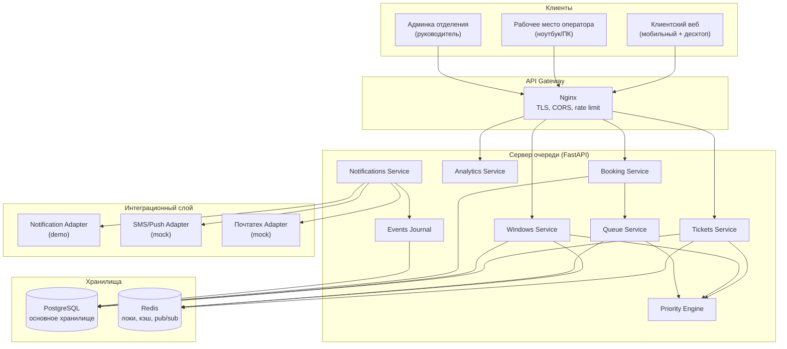
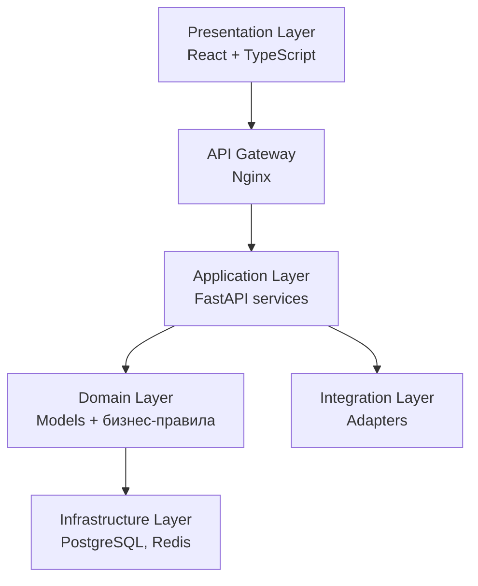
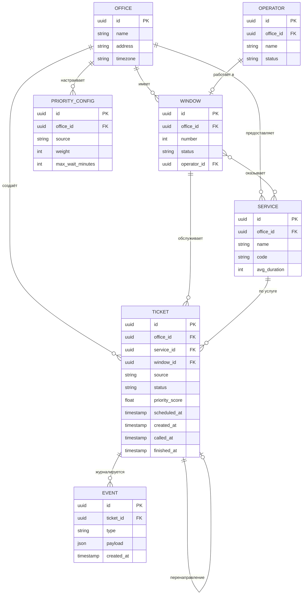
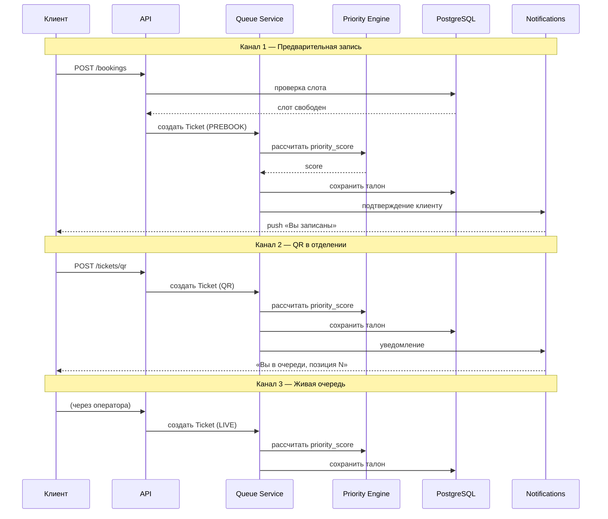
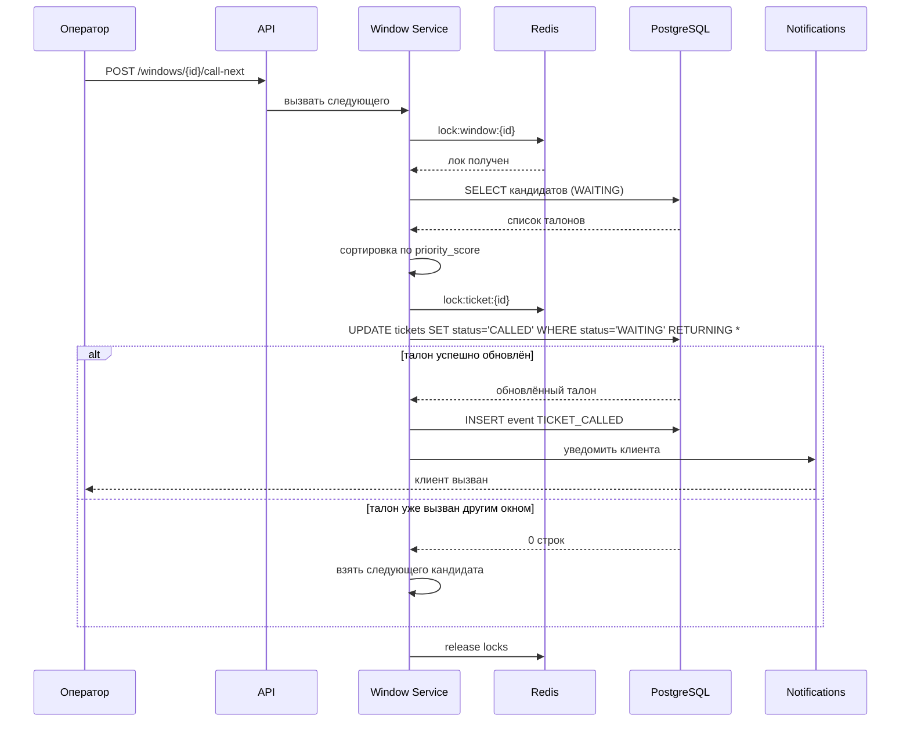
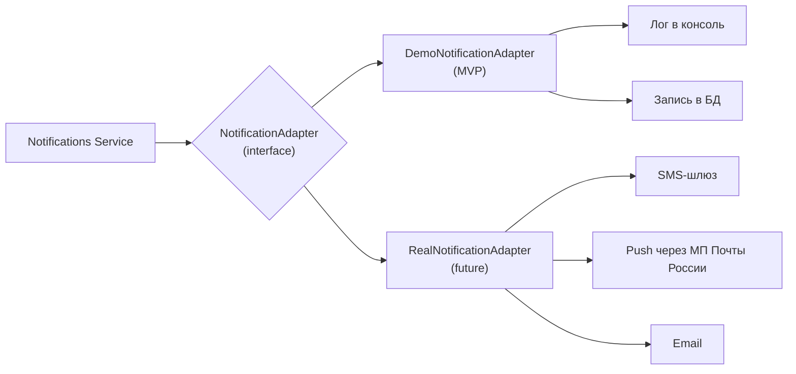
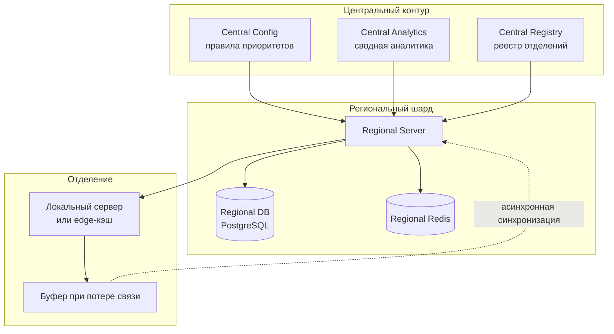

    # Архитектура системы «Цифровая очередь нового поколения»

## 1. Общая схема компонентов

## 2. Слои приложения

## 3. Модель данных (ER)

## 4. Потоки данных по каналам входа

## 5. Вызов клиента оператором

## 6. Интеграционный слой

Замена адаптера — через переменную окружения `NOTIFICATION_ADAPTER=demo|real`, без изменения логики очереди.

## 7. Масштабирование на 40 000 отделений

**Принципы:**
- данные изолированы по `office_id`;
- шардирование по региону;
- централизованные правила приоритетов, кэш в Redis;
- отделение работает автономно при потере связи;
- синхронизация — асинхронная, с буфером.

## 8. Технологический стек

| Слой | Технология | Российская альтернатива |
|---|---|---|
| Backend | FastAPI (Python) | Yandex Cloud, VK Cloud |
| БД | PostgreSQL | Postgres Pro |
| Кэш | Redis | Valkey / Redis Labs |
| Frontend | React + TypeScript | — |
| Gateway | Nginx | Angie |
| Контейнеры | Docker | — |
| ОС | Linux | Astra Linux, Alt Linux |