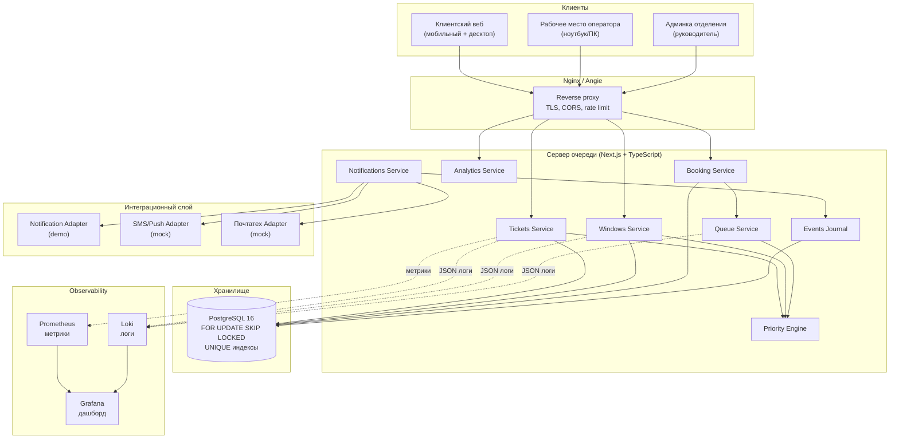
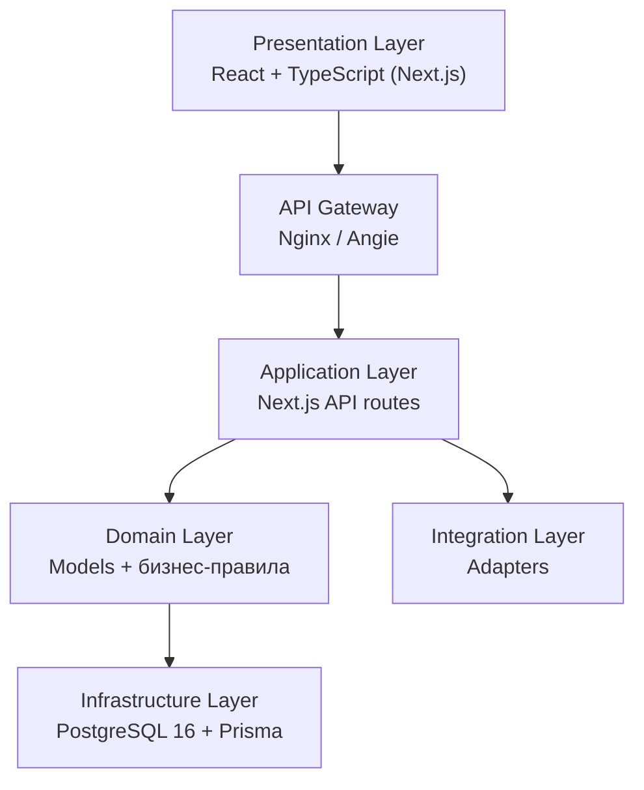
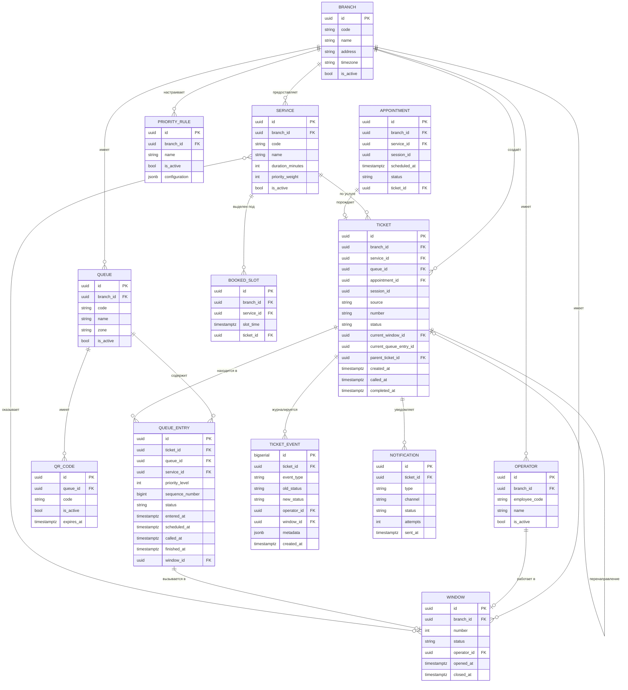
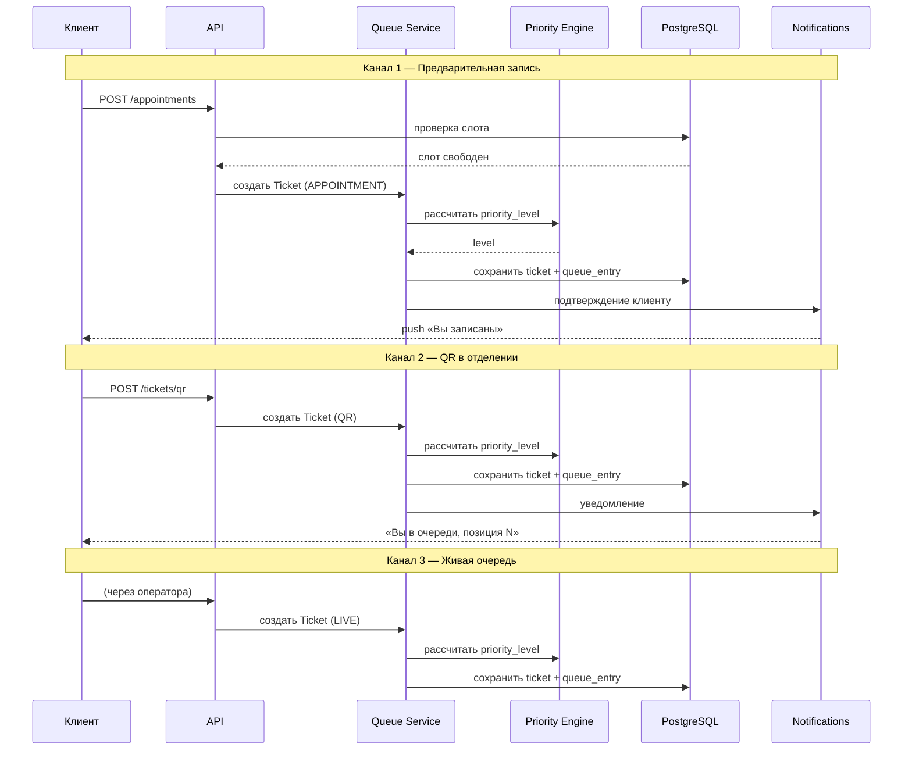
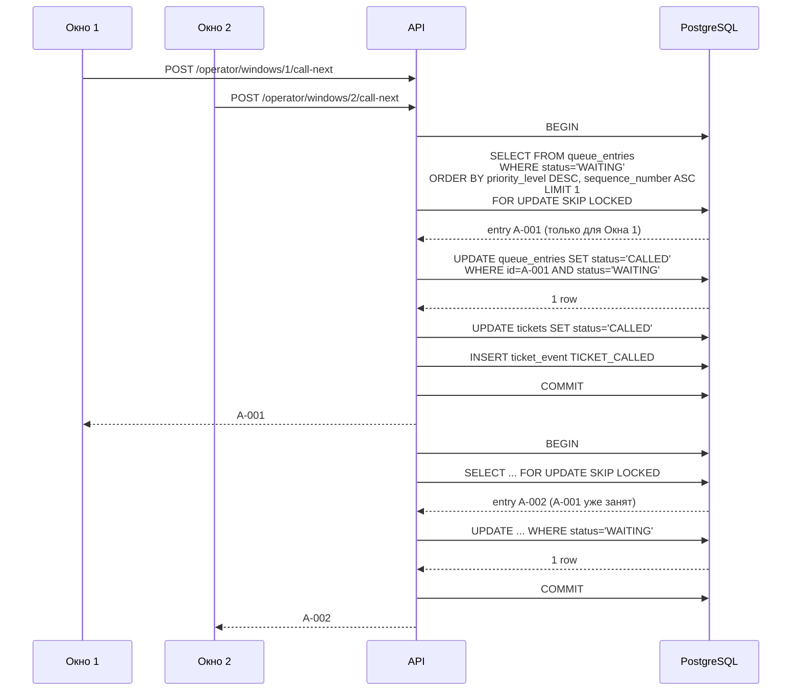
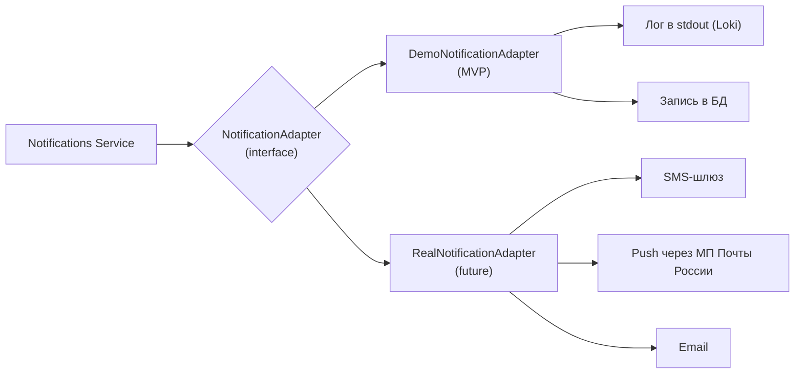
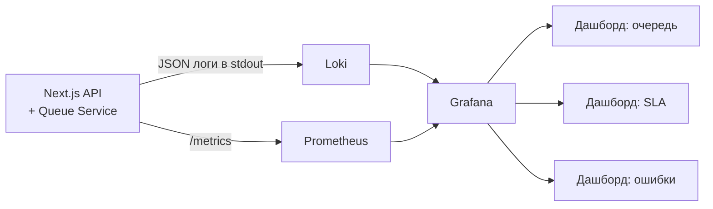
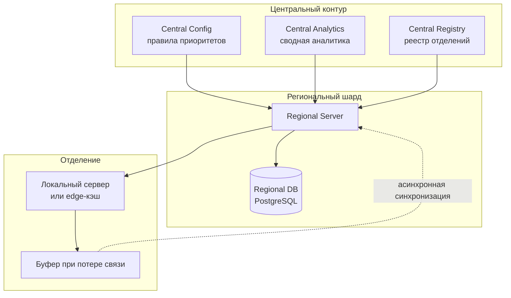

# Архитектура системы «Цифровая очередь нового поколения»

## 1. Общая схема компонентов

## 2. Слои приложения

## 3. Модель данных (ER)

## 4. Потоки данных по каналам входа

## 5. Вызов клиента оператором — защита от двойного назначения

**Три уровня защиты:**
1. `FOR UPDATE SKIP LOCKED` — база блокирует строку, второй оператор её пропускает.
2. `WHERE status='WAITING'` в UPDATE — атомарная проверка.
3. `UNIQUE` индекс на активный талон клиента — физически не может быть двух активных талонов.

## 6. Интеграционный слой

Замена адаптера — через переменную окружения `NOTIFICATION_ADAPTER=demo|real`, без изменения логики очереди.

## 7. Observability

**Что собираем:**
- **Loki** — структурированные JSON-логи всех сервисов;
- **Prometheus** — метрики: RPS, latency, количество талонов по статусам, среднее время ожидания;
- **Grafana** — дашборды для руководителя и для отладки.

## 8. Масштабирование на 40 000 отделений

**Принципы:**
- данные изолированы по `branch_id`;
- шардирование по региону;
- централизованные правила приоритетов;
- отделение работает автономно при потере связи;
- синхронизация — асинхронная, с буфером.

## 9. Технологический стек

| Слой | Технология | Российская альтернатива |
|---|---|---|
| Backend | Next.js + TypeScript | Совместим с Astra Linux, РЕД ОС |
| БД | PostgreSQL 16 | Postgres Pro, Tantor, ЛИНТЕР |
| ORM | Prisma | — |
| Локи | `FOR UPDATE SKIP LOCKED` | — |
| Кэш | Не используем | — |
| Redis | Не используем | — |
| Frontend | React + TypeScript | Kontur UI |
| Gateway | Nginx | Angie PRO |
| Логи | Loki | — |
| Метрики | Prometheus | — |
| Дашборд | Grafana | — |
| Контейнеры | Docker Compose | «Боцман», ALT Virtualization |
| ОС | Linux | Astra Linux, РЕД ОС, ALT Linux |

## 10. Что не используем и почему

| Компонент | Почему нет |
|---|---|
| Redis | Локи решаются через `FOR UPDATE SKIP LOCKED` в PostgreSQL |
| Микросервисы | Модульный монолит проще для MVP |
| Внешний кэш | Postgres справляется с 40 000 записей |
| RabbitMQ | Не нужен для MVP, уведомления — через демо-адаптер |