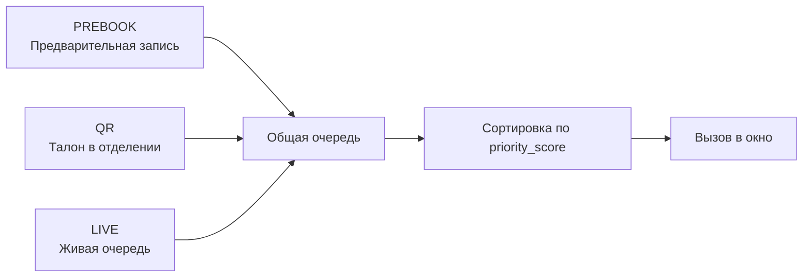
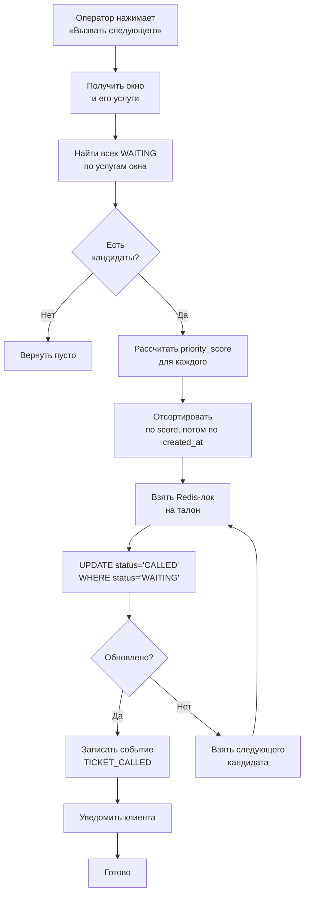
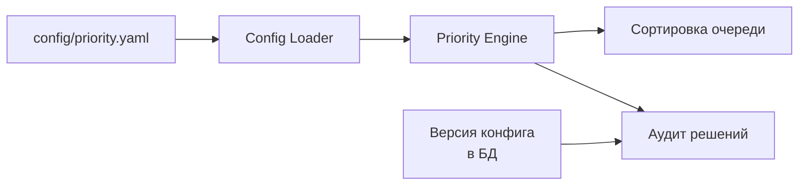
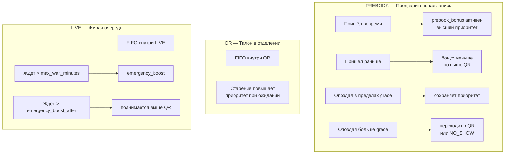
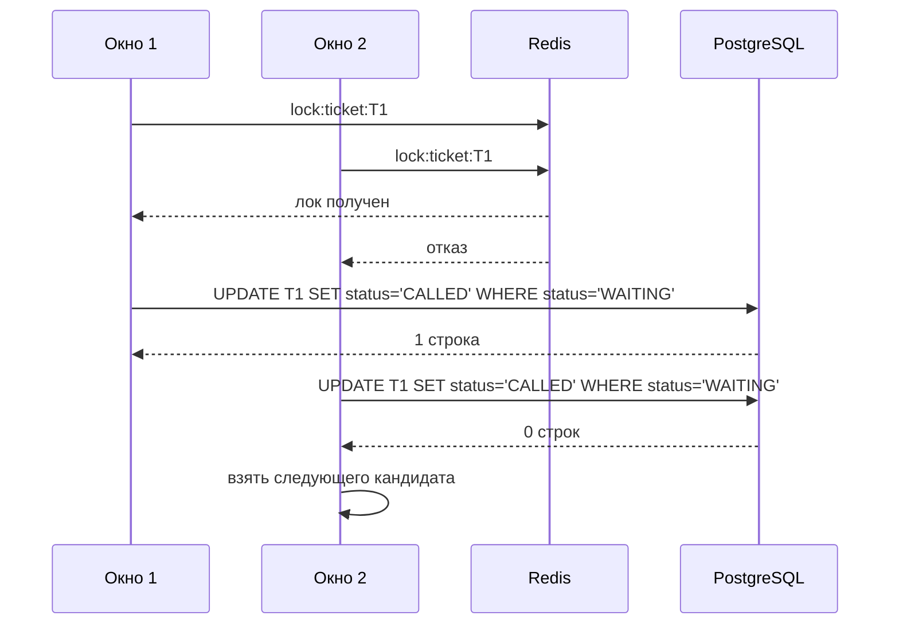
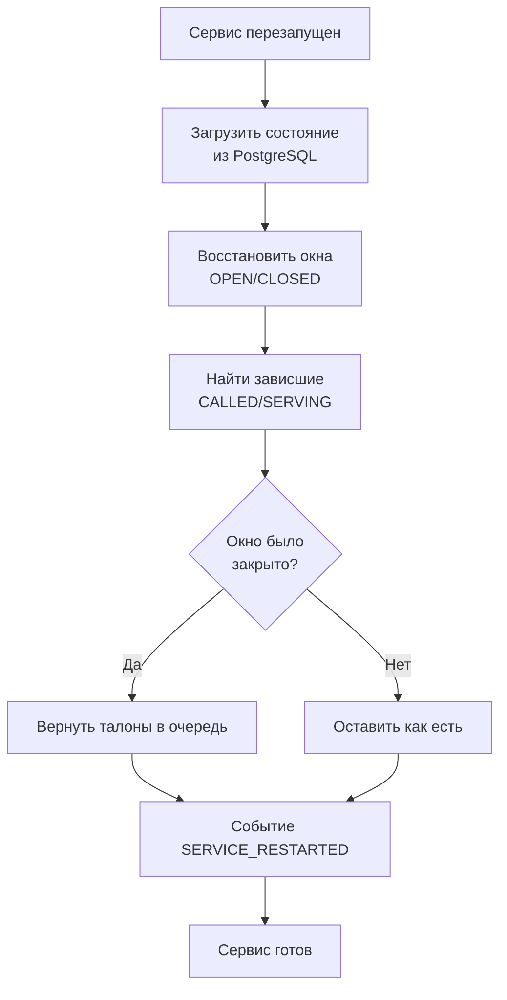
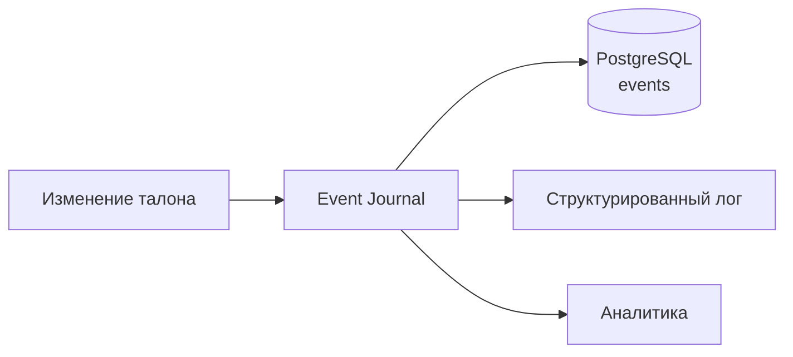
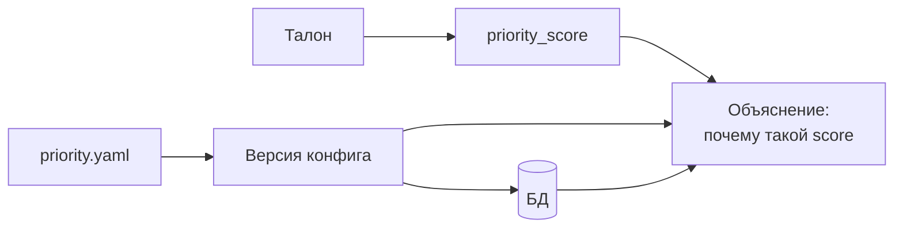

# Алгоритм приоритетов очереди

## 1. Три источника талонов



## 2. Формула приоритета

```
priority_score = base_weight[source]
               - waiting_minutes * aging_factor
               + service_weight
               - (is_prebook_due ? prebook_bonus : 0)
```

**Меньше `priority_score` — выше в очереди.**

| Параметр | Смысл |
|---|---|
| `base_weight` | Базовый вес источника |
| `waiting_minutes` | Сколько клиент уже ждёт |
| `aging_factor` | Коэффициент старения (защита от голодания) |
| `service_weight` | Вес услуги |
| `prebook_bonus` | Бонус, если наступило время предзаписи |

## 3. Логика выбора следующего талона



## 4. Конфигурация



Все коэффициенты — в `config/priority.yaml`. Изменение правил не требует пересборки.

## 5. Поведение по источникам



## 6. Защита от двойного назначения



**Три уровня защиты:**
1. Redis-лок на талон.
2. `WHERE status='WAITING'` в UPDATE — атомарная проверка.
3. Уникальный индекс в БД на активный талон клиента.

## 7. Закрытие окна с активным клиентом


## 8. Восстановление после перезапуска



## 9. Журналирование событий



Типы событий:
- `TICKET_CREATED`
- `TICKET_CALLED`
- `TICKET_STARTED`
- `TICKET_FINISHED`
- `TICKET_RETURNED`
- `TICKET_REDIRECTED`
- `TICKET_CANCELLED`
- `TICKET_NO_SHOW`
- `WINDOW_OPENED`
- `WINDOW_CLOSED`
- `WINDOW_CLOSED_WITH_ACTIVE`
- `SERVICE_RESTARTED`

## 10. Воспроизводимость



Для каждого талона можно восстановить, почему он получил такой `priority_score` — на основе версии конфига и входных данных.