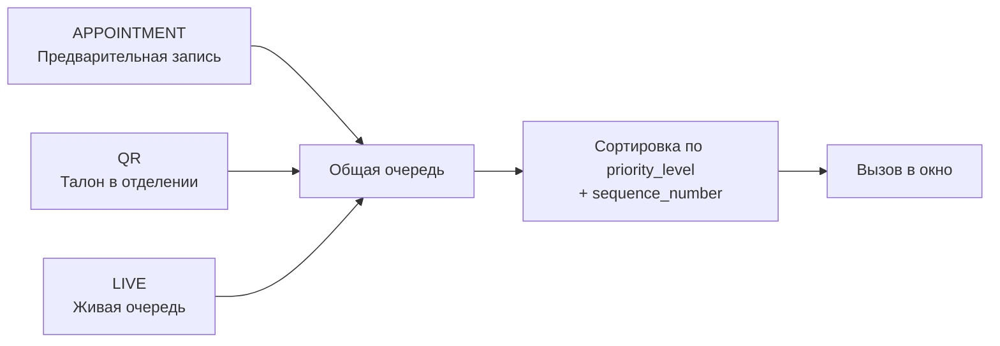
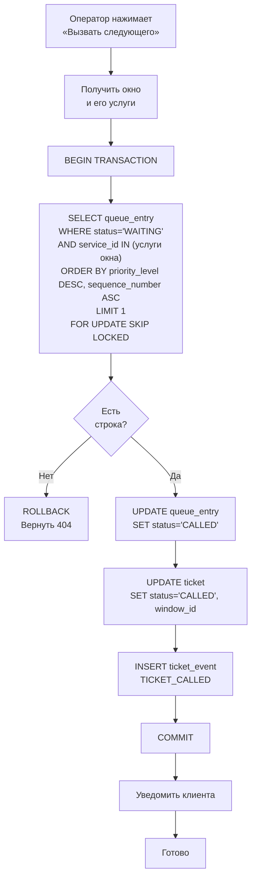
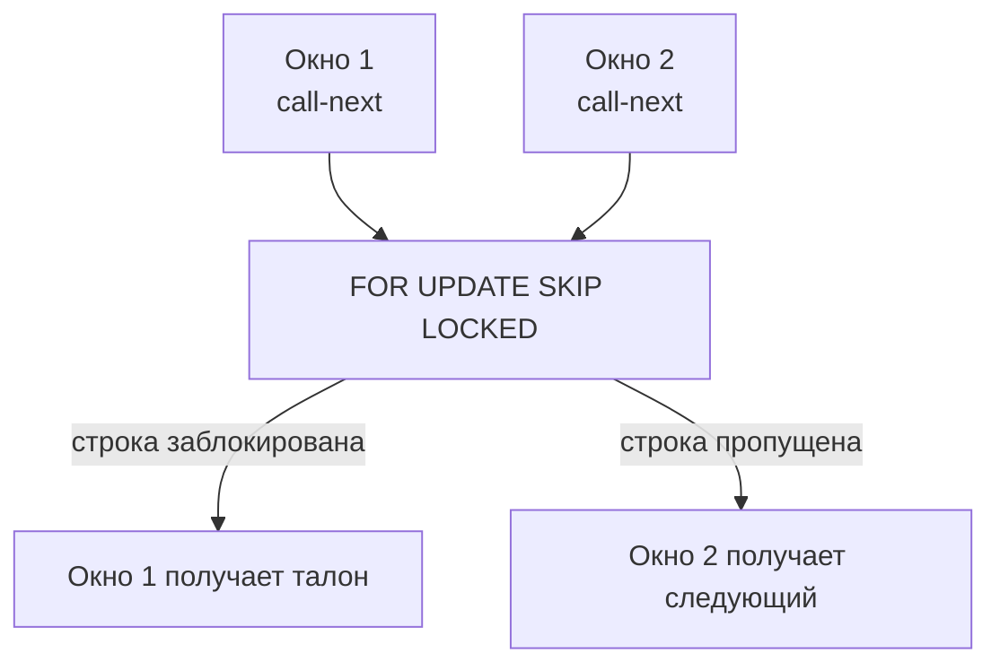
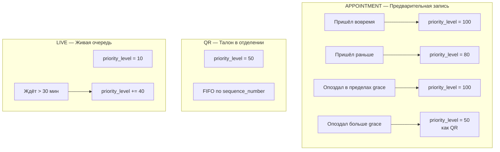
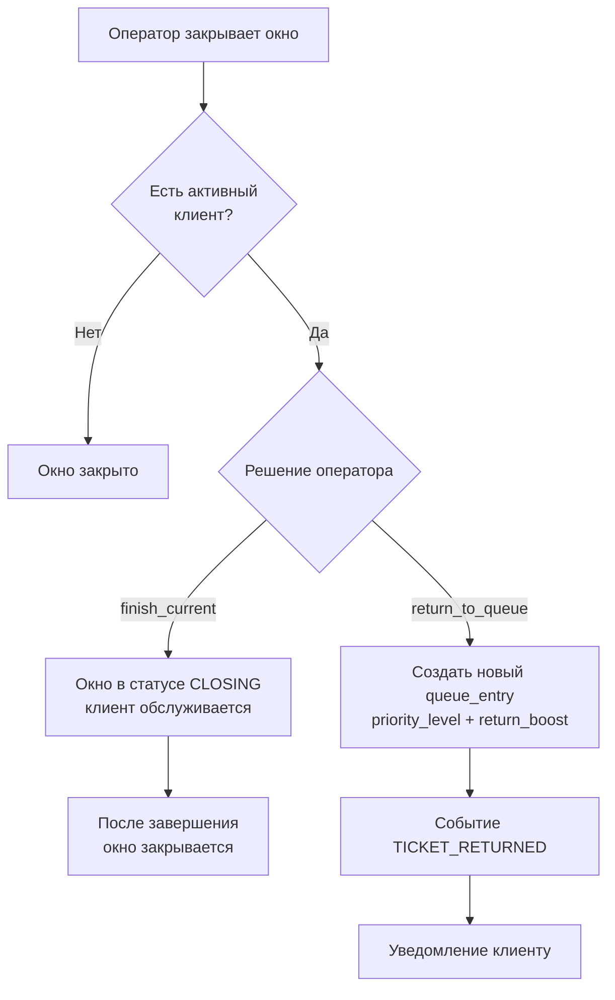
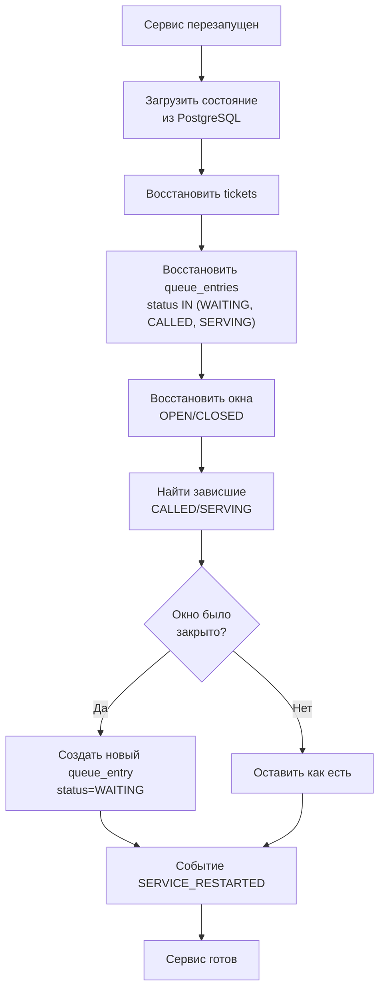

# Алгоритм приоритетов очереди

## 1. Три источника талонов



## 2. Уровни приоритета

**Статический `priority_level`** — вычисляется при постановке талона в очередь:

| Источник | Базовый level | Условие |
|---|---|---|
| `APPOINTMENT` | 100 | Если наступило время слота (± grace period) |
| `QR` | 50 | FIFO внутри уровня |
| `LIVE` | 10 | FIFO внутри уровня |
| `RETURNED` | +20 к базовому | При возврате в очередь, но не выше APPOINTMENT |
| `EMERGENCY` | +40 к LIVE | Если ждёт больше `emergencyBoostAfter` минут |

**Порядок внутри уровня — по `sequence_number` (FIFO).**

## 3. Логика выбора следующего талона



## 4. Защита от двойного вызова

**Три уровня, все на уровне PostgreSQL:**



| Уровень | Что делает | Где |
|---|---|---|
| 1 | `FOR UPDATE SKIP LOCKED` | Блокирует строку при выборе |
| 2 | `WHERE status='WAITING'` в UPDATE | Отклоняет повторное обновление |
| 3 | `UNIQUE INDEX` на активный талон | Физически не даёт дубль |

```sql
-- Уровень 3
CREATE UNIQUE INDEX ux_active_ticket_per_session
ON tickets (session_id)
WHERE status IN ('WAITING', 'CALLED', 'SERVING');
```

## 5. Конфигурация

Все коэффициенты — в `priority_rules.configuration` (JSONB) и в `config/priority.yaml` для демо.

```yaml
priority:
  sources:
    APPOINTMENT:
      base_weight: 100
      grace_minutes: 10
    QR:
      base_weight: 50
    LIVE:
      base_weight: 10
      max_wait_minutes: 60

  aging:
    enabled: true
    factor: 5
    cap: 40

  return:
    enabled: true
    boost: 20
    max_boost: 20

  live_queue:
    max_wait_minutes: 60
    emergency_boost_after: 30
    emergency_boost: 40

  window:
    close_with_active_client: "finish_current"
```

**Изменение правил не требует пересборки** — читается при следующем запросе.

## 6. Поведение по источникам



## 7. Закрытие окна с активным клиентом



**По умолчанию:** `finish_current` — дообслужить и потом закрыть.

## 8. Восстановление после перезапуска



**Источник истины — только PostgreSQL.** Redis не используется.

## 9. Журналирование событий

Все изменения — в `ticket_events` (append-only, `BIGSERIAL id`):

| Событие | Когда пишется |
|---|---|
| `TICKET_CREATED` | Создание талона |
| `TICKET_CALLED` | Оператор вызвал |
| `TICKET_STARTED` | Начало обслуживания |
| `TICKET_FINISHED` | Завершение |
| `TICKET_RETURNED` | Возврат в очередь |
| `TICKET_REDIRECTED` | Перенаправление |
| `TICKET_CANCELLED` | Отмена клиентом |
| `TICKET_NO_SHOW` | Клиент не пришёл |
| `WINDOW_OPENED` | Окно открыто |
| `WINDOW_CLOSED` | Окно закрыто |
| `WINDOW_CLOSED_WITH_ACTIVE` | Закрытие с активным клиентом |
| `SERVICE_RESTARTED` | Перезапуск сервиса |
| `NOTIFICATION_FAILED` | Ошибка уведомления |
| `INTEGRATION_TIMEOUT` | Таймаут внешнего сервиса |

**UPDATE и DELETE на `ticket_events` запрещены на уровне прав БД.**

## 10. Воспроизводимость

Для каждого талона можно восстановить:
- какой был `priority_level` при постановке;
- когда и кем был вызван;
- какие были переходы статусов;
- почему вернулся в очередь.

Всё это — по `ticket_events` + `queue_entries` + текущему `tickets`.